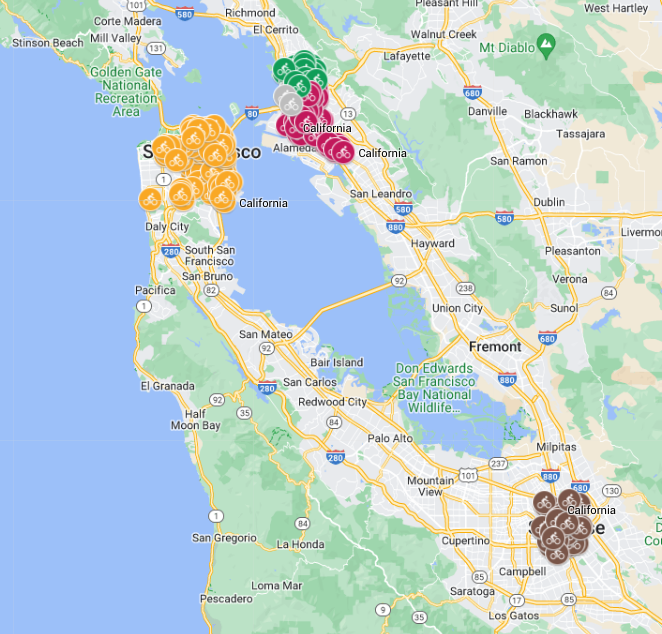

# Data Analysis/Communicate Data Findings Report: Bike Ride Trends of Ford GoBike System
## by: Khaled Zoheir

## Dataset

> Bay Wheels is a regional public bicycle sharing system in California's San Francisco Bay Area. It is operated by Motivate in a partnership with the Metropolitan Transportation Commission and the Bay Area Air Quality Management District.Bay Wheels is 'the first regional and large-scale bicycle sharing system deployed in California and on the West Coast of the United States. It was established as Bay Area Bike Share in August 2013. As of January 2018, the Bay Wheels system had over 2,600 bicycles in 262 stations across San Francisco, East Bay and San Jose.

> In June 2017 the system was officially re-launched as Ford GoBike in a partnership with Ford Motor Company. After Motivate's acquisition by Lyft, the system was renamed to Bay Wheels in June 2019. The system is expected to expand to 7,000 bicycles around 540 stations in San Francisco, Oakland, Berkeley, Emeryville, and San Jose.

> Udacity provided a link to the dataset. After some work, I found this was for one month only (Feb). Looked at knowledge base: https://knowledge.udacity.com/questions/668930 and them got the files from: https://s3.amazonaws.com/baywheels-data/index.html. This is slightly different dataset with some of the features are missing and others are present

> After an initial investigation regarding the location of the satations. I found that they are located in 5 differnet cities in California: San Francisco, San Jose, Oakland, Berkeley and Emerville:

## Summary of Findings

> Surprisingly! The summer is not the highest utilization. May be it's too hot for biking. The highst months are spring and autumn months. Not  too cold and not too hot apparently

> Working days: Mon-Fri shows higer utilization than weekends. This implies that riders are mainly using the bikes as part of their daily routine rather than for leasure.

> The peek hours are: 7:00 - 9:00 am and 4:00 - 7:00 pm.  We can easily conclude that many are using it to commute to work back and forth.

> There are 2 types of users: Subscribers and Customers. Most rides are by Subcribers (4:1 ratio). This is a strong indication to show who is our main customer

> Most rides lasts for 10 - 15 minutes

> It's not obvious to get the distance traveled. We can get a feel of the distance traveld (ground distance). It's between 1-2 KM. For this I used a formula to translate lat-long to ground distance.

> Usually Subscribers have a shorter duration than Customers. Also, they are mainly focussed (lower std): 5-13 minutes

> For subscribers the duration is almost constant throughout the week. For Customer there is an increase in duration with slightly higher variance during weekend

## Key Insights for Presentation

> Note: I focussed a lot on the location of the stations. I can provide more usefull insights and include more pictures. However, du to time constraints I was not able to do so

> Business Perspective: Our main customers are the Subscibers

> Operation Perspective: We need to provide the best possible service and have the bikes available when and where needed. 
* For this we can see that we need to send more bikes to the following station: `San Francisco Caltrain (Townsend St at 4th St)` in the morning during weekdays
* Those bikes can mainly come from the following station: `Montgomery St BART Station (Market St at 2nd St)`
* This is just an aexample on how can we support the operation. similar analysis needs to be done for other areas as well

> I spent some of time for mapping visualization. I still have some work to do: Combining heatmap on Google maps and programatically generate the maps. [Google Create a heatmap](https://support.google.com/fusiontables/answer/1152262?hl=en) and (Heat map layer)[https://developers.google.com/maps/documentation/javascript/heatmaplayer]